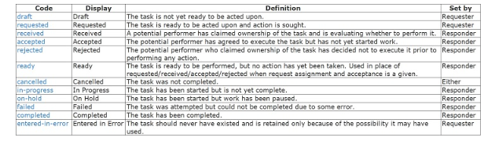
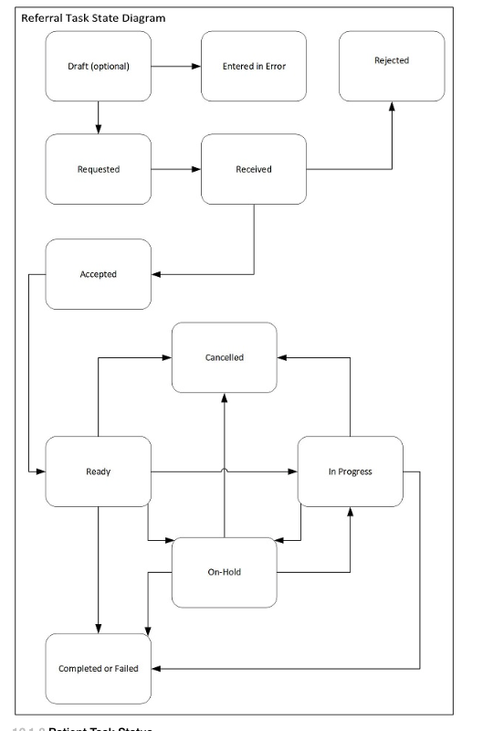
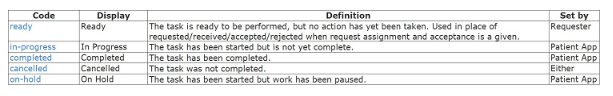
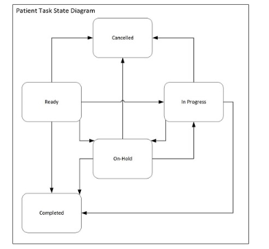

# 12 Checking Task Status

## 12.1 Use of Task Status 
- Describes the use of Task.Status 
- Difference between ReferralTask and PatientTask 

### 12.1.1 Referral Task Status 

[Referral Task Status](http://hl7.org/fhir/us/sdoh-clinicalcare/STU2/StructureDefinition-SDOHCC-TaskForReferralManagement.html)

 

<figure-caption><strong>Figure 1. Referral Task Status Diagram </figure-caption>

 

### 12.1.2 Patient Task Status 

 

 

## 12.2 Checking Task Status 
    - Service Delivery Organizations - burden of monitoring tasks
    - EHR Systtmes 
### 12.2.1 Polling 
- Description on how to search for tasks 
- frequency of polling 

### 12.2.2 Subscription 
- describes subsription mechanism where client creates subscription instance on the server that indicates that it wants to be notified about changes 

#### 12.2.2.1 Task Topic 

- This topic allows for monitoring for newly created tasks as well as updates to assigned or requested tasks.

#### 12.2.2.2 ServiceRequest Topic 

- This topic allows for monitoring for changes to a ServiceRequest when an organization is involved in fulfilling that request