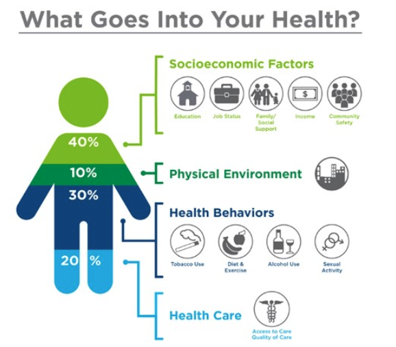

# 2. Gravity Background 

## 2.1 Why Social Determinants of Health Matter
- Definition of SDOH 
- Links to current efforts that address SDOH 

 

*(Make the image centered and change the width to make it look better )*

What Goes into Your Health Diagram
## 2.2 Standardizing SDOH Exchange 
- Background of Standardizing SDOH data
- Emerging Intitiative standardizing SDOH data 
- Opportunities
- Risks 
## 2.3 Gravity Project Overview
- Gravity Project Background 
- Mission 
- HL7 FHIR Accelerator Program 
- Link to Confluence Site  
## 2.4 Gravity Project Challenge Statement  
- What is a challenge statement? 