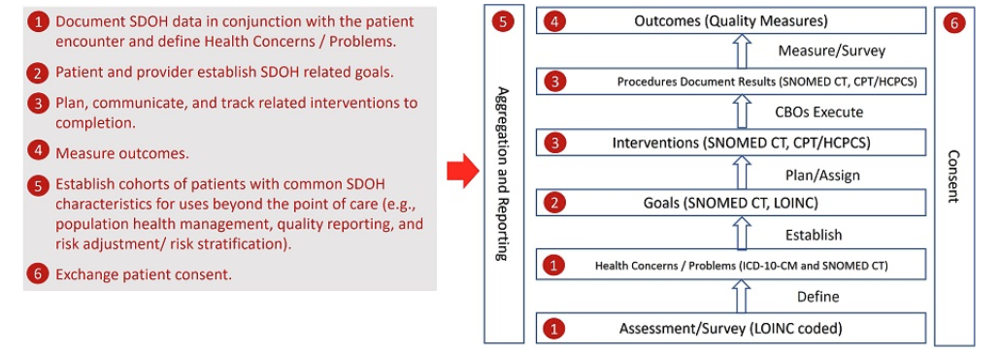

# 3. SDOH Clinical Care Background 

## 3.1 SDOH Clinical Care Scope 
The Gravity Project focus for this version of the IG is to standardize the exchange of SDOH information related to the following activities:

1) assessment of social risk,

2) establishing coded health concerns/problems,

3) creating patient driven goals, and

4) defining a RESTful closed loop referral process to manage interventions.

                       *Insert Diagram #1*  

 

  
- Narrtative that describes the SDOH domains rather than the above diagram 
- Link to current list of domains [SDOH Domains ](https://confluence.hl7.org/display/GRAV/Terminology+Workstream+Dashboard)

- The scope of interactions plan to cover all the interactions below.. 

*There is no explanation to this diagram, it is a littler premature, still haven't been introduced to these actors what does scope of interactions mean?* 

                            *Insert Diagram 2*

<figure-caption>Figure 2. The Scope of Interactions. </figure-caption>

 

### 3.1.1 Out of Scope 
    1. Guidance on frequency of taking assesment 
    2. Standards for reporting quality measures 
    3. Addressing Consent beyond sharing to HIPPA 

*Does this belong in background, is this out of scope for diagram2*
## 3.2 Conceptual Framework 

                        *Insert Diagram 3*

 

## 3.3 Data Modeling Framework 
                        *Insert Diagram 4*
*This could be a good example of one of the diagrams we link link the mCode diagram to the existing artifact*

 

