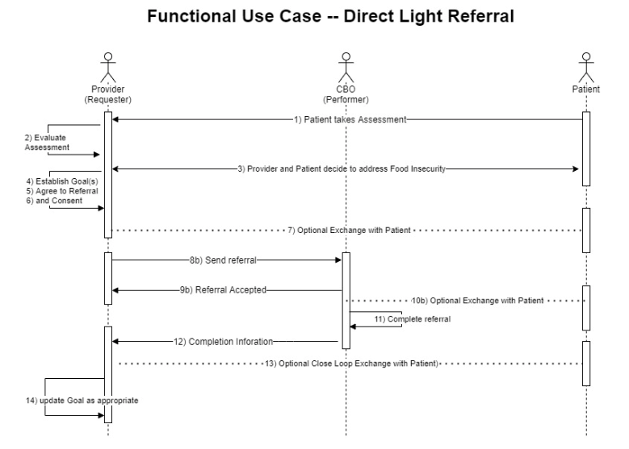
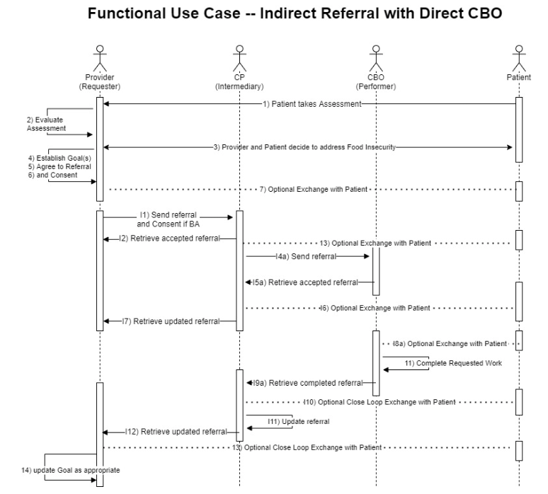

# Functional Use Cases 

- Link to Patient Stories [Patient Stories ](https://confluence.hl7.org/display/GRAV/Patient+Stories)
- These use cases are represented by workflow diagrams on the Exchange Workflow Page [Exchange Worklows Page ](http://build.fhir.org/ig/HL7/fhir-sdoh-clinicalcare/exchange_workflow.html)

- The following numbering is use throughout this section where  N is an integer number:

    - **N (e.g. 1-14)** are steps common to all functional use cases
    - **IN (e.g. I1-I12)** are additional steps used only by Indirect use cases
    - **INa (e.g. I8,I9)** are steps used by the Indirect use case when communicating with a FHIR API enabled CBO
    - **INb (e.g. I8b, I9b)** are steps used by the Indirect use case when communicating with a FHIR application enabled CBO

## 4.1 Overview 

- Defines use cases based on specific exchanges 

    - A direct referral 
    - A "light" version of the direct referral 
    - an indirect refferal 
    - Patient application communicate directly with any entity 

## 4.2 Actors 
- Provider
- Care Coordinator 
- Patient 
- Community Based Organization (CBO)
- Coordination Platform (CP)
## 4.3 Business Associates
- CBO and CP not covered entities 
    - can be business associates (covered entity)
- Information describing what a covered entity is *(Is this necessary doesn't seem relevant maybe a link to informaiton would be better)*
## 4.4 Direct Referral 
### 4.4.1 Actors 
    - Provider 
    - Patient 
    -Community Based Organization 
### 4.4.2 Assumptions 
    - Provider has aa FHIR API 
    - Patient has a FHIR enabled app
    - CBO has a FHIR API 
 *Is this not common knowledge* 
### 4.4.3 Provider Actions 
1. Patient takes standardized assessment tool to identify risks
2. Provider evaluates assessment and identifies Food Insecurity and Transportation Insecurity
3. Provider and patient determine that it is most important to address the Food Insecurity first – provider promotes the health concern to the problem list
4. Provider and patient add a goal related to this problem to pursue enrollment in a SNAP program
5. Provider and patient agree that a referral to a contracted or non-contracted CBO is an appropriate next step
6. Patient consents to be referred to the CBO and consents to have the information that will be provided sent to the CBO
7. Optional: Provider makes information regarding the referral available to the patient’s application

### 4.4.4 Provider- CBO Actions 
8a. Provider or Care Coordinator creates and sends an electronic referral to the C

9a. CBO receives and accepts referral

 *What's the purpose of the 'a'?* .

### 4.4.5 CBO Actions 
10a. Optional: CBO communicates with the patient via their application to schedule appointments, collect additional information, etc.

CBO completes the evaluation and enrollment, updates the status of the referral to completed, and includes information on what was completed

### 4.4.6 Provider Actions 
1. Provider receives the updated status
2. Optional: Provider closes loop with patient via questionnaire available to a patient’s application
3. Provider determines if the goal has been satisfied and/or progress has been made on the goal and updates the goal appropriately

### 4.4.7 Considerations
- CBOs are typically not BAs of covered entities and therefore not bound by HIPAA’s privacy and security requirements
- Provider may not always have the relationship with the CBO
- CBO may not accept the referral or be unable to perform the requested service
- Closing the loop via patient reported outcome

<figure-caption><strong>Figure 1. Functional Use Case -- Direct Referral. </figure-caption>

 

*I would put this diagram at the top of the section, I would aslo add the caption* 

## 4.5 Direct Referral Light 

<figure-caption><strong>Figure 1. Functional Use Case -- Direct Light Referral. </figure-caption>

 

### 4.5.1 Actors
### 4.5.2 Assumptions 
### 4.5.3 Provider Actions 
### 4.5.4 CBO- Provider Actions 
### 4.5.5 CBO Actions 
### 4.5.6 Provider Actions 
### 4.5.7 Consideration

## 4.6 Indirect Referrral with Direct CBO 

<figure-caption><strong>Figure 1. Functional Use Case -- Indirect Referral. </figure-caption>

 

### 4.6.1 Actors
### 4.6.2 Assumptions 
### 4.6.3 Provider Actions 
### 4.6.4 Provider- CP- CBO Workflow 
### 4.6.5 Provider Actions 
### 4.6.6 Considerations same as Direct Referral

## 4.7 Indirect Referral with Direct Light CBO 

<figure-caption><strong>Figure 1. Functional Use Case -- Indirect Referral with Direct CBO. </figure-caption>

 

### 4.7.1 Actors
### 4.7.2 Assumptions 
### 4.7.3 Provider Actions 
### 4.7.4 Provider- CP- CBO workflow (note: steps with a “b” suffix are specific to this referral)
### 4.7.5 Provider Actions 
### 4.7.6 Considerations same as Direct Referral

## 4.8 Closing the Loop with the Patient 
### 4.8.1 Actors 
### 4.8.2 Patient Workflow (from above functional use cases)
### 4.8.3 Considerations 