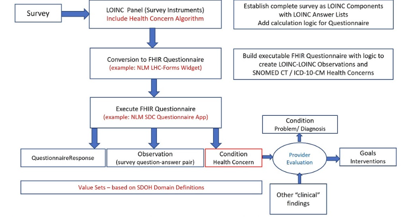

# 5 Survey Instrument Support 
## 5.1 Enabling Survey Instruments 

- The purpose of risk surveys 
    - Pros + Cons 
- Output = QuestionaireResponse --> Observation and Condition

- Describes the approach to incorporate a risk survey into the information flow 

<figure-caption><strong>Figure 1. Risk Survey in Workflow </figure-caption>

 

### 5.1.1 [Hunger Vital Sign (HVS) Survey Example](https://loinc.org/88121-9/)

- Outlines vital sign survey example representation
 
### 5.1.2 [Protocol for Responding to and Assessing Patients Assets, Risks, and Experience (PREPARE) Survey Example](https://loinc.org/93025-5/)  

- Outlines partial example of a PREPARE survey 

 *Not much information on what these surveys are* 
