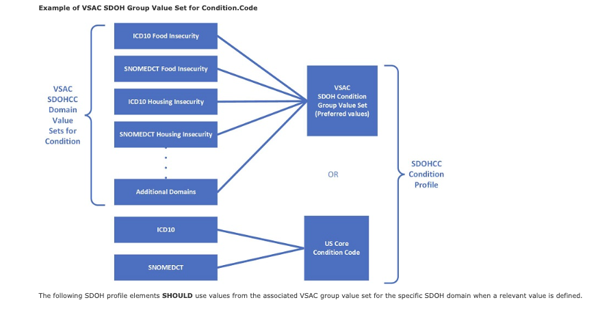

# 7. Support for Multiple Domains 

## 7.1 Code Systems and Value Sets 

- Describes how the Gravity Terminology WorkStream works 
- [Supplemental Guide](https://confluence.hl7.org/display/GRAV/Supplemental+Guide)

## 7.2 External Value Set Guidance 

· [Social Determinants of Health Conditions Value Set](https://vsac.nlm.nih.gov/valueset/2.16.840.1.113762.1.4.1196.788/expansion)

· [Social Determinants of Health Goals Value Set](https://vsac.nlm.nih.gov/valueset/2.16.840.1.113762.1.4.1247.71/expansion)

· [Social Determinants of Health Service Requests Value Set](https://vsac.nlm.nih.gov/valueset/2.16.840.1.113762.1.4.1196.790/expansion)

· [Social Determinants of Health Procedures Value Set](https://vsac.nlm.nih.gov/valueset/2.16.840.1.113762.1.4.1196.789/expansion)

<figure-caption><strong>Figure 1. Example of VSAC SDOH Group Value Set for Condition.Code </figure-caption>

 