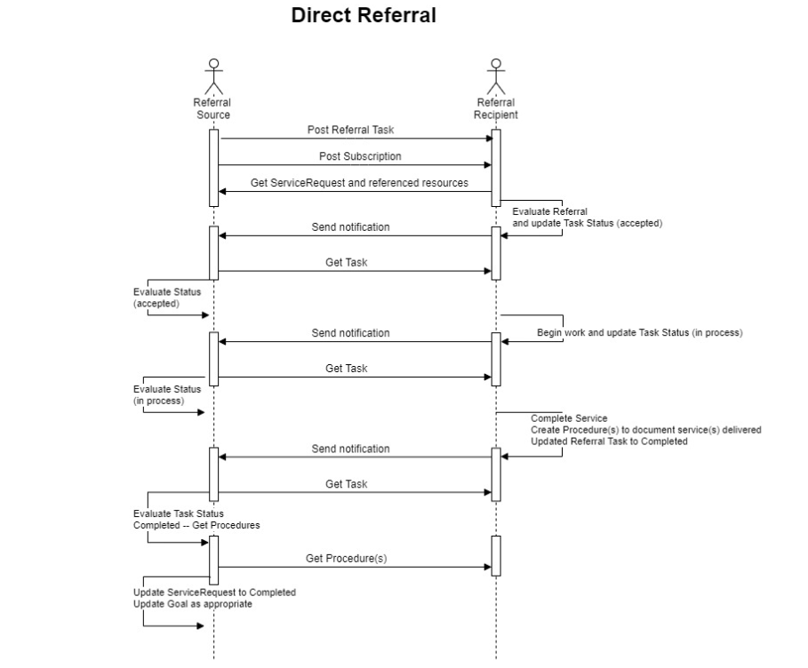

# 8. Exchange Workflow 

## 8.1 General Workflow 

    General Process 
    1. Asses Patient and Determine Risk
    2. Patient and Provider estabilsh goals 
    3. Patient and Poivider agree on referrals/interventions, consent, task sent to performing entitty

<figure-caption><strong>Figure 1. General Workflow </figure-caption>

 

    System/System Interactions Supported:
    1. referrals via an intermediary (or indirect referrals) that may include interactions with multiple service performers,
    2. direct and direct light (where the interaction is with an application) referrals,
    3. interactions with a patient to complete a questionnaire or “form”, and
    4. interactions with a patient to cancel a service or indicate the outcome of the service

<figure-caption><strong>Figure 2. Overall Interactions </figure-caption>

 

## 8.2 Workflow and Managing Consent 

    Describes specification for consent resource.

    The following diagram depicts: 
    1. The patient interacts with the provider and takes a risk survey that creates the specific health concerns defined by the survey and the patient’s responses.
    2. The provider and patient determine which of the health concerns are valid, and “promote” the most important ones to the “problem list” to be addressed. The patient and provider may establish goals and agree on the specific referrals/interventions/exchanges (not depicted in this diagram). The patient provides consent to share information with the relevant organizations.
    3. The Provider’s System provides (via a FHIR API) the ability to share information with
        - CBO
        - CP
        - Payer

<figure-caption><strong>Figure 3. Exchange Workflow Managing Consent </figure-caption>

 

## 8.3 Closed Loop Referrral 
### 8.3.1 Actors
    Provider
    1. a provider
    2. a payer as part of care management, risk assessment, or via programs that assess and intervene regarding social risk
    3. a CP 

    CP
    1. This is a service that accepts referrals (it may also create them)
    2. May determine which Community Based Organization (CBO) is capable and available to provide the appropriate service
    3. Engages the CBO to perform the referral 
    4. Tracks the referral process to completion
    5. Reports status back to the Referring Entity

    CBO/ Performer
    1. Provides one or more social risk services 
    2. interacts with the CP or RE to provide status of the referral 

### 8.3.2 Direct Referral 
(*Link to the Direct Referral Functional Use Case Diagram*)
#### 8.3.2.1 Interaction Diagram 

<figure-caption><strong>Figure 4. Workflow Direct Referral </figure-caption>

 

#### 8.3.2.2 Workflow Diagram 

<figure-caption><strong>Figure 5. Workflow Direct Referral </figure-caption>

 

### 8.3.3. Direct Referral Light 
#### 8.3.3.1 Interaction Diagram 

<figure-caption><strong>Figure 6. Workflow Direct Referral Light </figure-caption>

 

#### 8.3.3.2 Workflow Diagram 

<figure-caption><strong>Figure 7. Workflow Direct Referral </figure-caption>

 

### 8.3.4 Indirect Referral 
    - Includes all the SHALL supports
#### 8.3.4.1 Interaction Diagram 

<figure-caption><strong>Figure 8. Workflow Indirect Referral </figure-caption>

 

#### 8.3.4.2 Workflow Diagram 

<figure-caption><strong>Figure 9. Workflow Indirect Referral </figure-caption>

 

### 8.3.5 Notes on Direct and Indirect Referrals 
### 8.3.6 Patient Interactions 

    List of supported interactions from a patient/client application 
#### 8.3.6.1 Overall Workflow 

<figure-caption><strong>Figure 10. Patient Client Interaction </figure-caption>

 

    Describes the high level of exchanges 

#### 8.3.6.2 Detailed Workflow for a Single Questionnaire 

<figure-caption><strong>Figure 11. Patient Client Questionaire/ Form </figure-caption>

 

## 8.4 Support for API Access to SDOH Information

Link to [ONC 21st Century Cures Act Final Rule](https://www.healthit.gov/curesrule/)